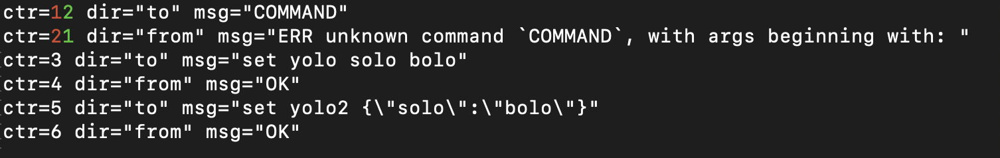

# rkrd
redis recorder for behavioural testing

## Installation

Assuming that your `$GOPATH` is on yourn `$PATH`:
```sh
go get github.com/ttacon/rkrd
```

## usage

### Recording Redis interactions

To record redis interactions, run the following:

```sh
# Starts rkrd Redis-compatible engine on port 8080
rkrd p
```

You can then connect to `rkrd` the same as you would from any Redis client
library or even `redis-cli`.

You should then see files in the directory that you started `rkrd` in with the
format `rkrd-$EPOCH_TIMESTAMP.rkrd`.

### Diffing `.rkrd` files.

Once you have two or more `.rkrd` files, you can diff them with `rkrd`.

```sh
rkrd d rkrdr-1565535084.rkrdr rkrdr-1565537642.rkrdr
```



### Cleanup

```sh
rkrd cleanup
```